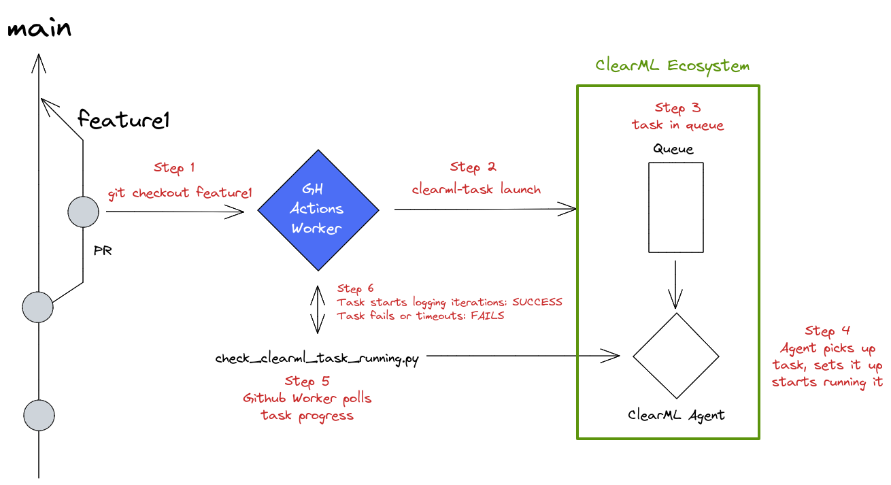

# GitHub Action For Testing If Code Is Remotely Runnable.

The goal of this github action is to verify code quality and repository integrity by launching the repository as a ClearML Task on a remote machine using ClearML-Agent. After 1 or more iterations are detected, the task will be killed so no excess computation will be done. It is meant as a quality assurance check while working on a PR, including this check will ensure that every PR is able to be run by a ClearML agent.



The general flow of the action is as follows:

*Step 1:* The Github actions worker checks out the code in the PR that triggered the workflow

*Step 2:* The Github actions worker launches this repository as a remote task using the `clearml-task` CLI command. Most of the action arguments correspond to the arguments for the `clearml-task` command you can find [here](https://clear.ml/docs/latest/docs/apps/clearml_task).

*Step 3:* When the task is launched in step 2, it is added to a Queue. You can make these yourself in the ClearML server webUI.

*Step 4:* A ClearML Agent pulls the task from the Queue and starts installing packages and pulling code to run it remotely. NOTE: you are responsible to set up your own agent or autoscaler to listen to this Queue. If no workers are listening to the Queue, the task will never be executed.

*Step 5:* The Github actions worker runs a python script that polls the status of the launched task. If it failed or was aborted, the pipeline will fail. If it is enqueued, it will wait and if it is in progress it will watch for any incoming iteration reportings. If at least one iteration is detected, the task is deemed runnable and the pipeline will succeed. The task will be aborted and archived.

## Example usage

```yaml
name: Check remotely runnable
on:
  pull_request:
    branches: [ main ]
    types: [ assigned, opened, edited, reopened, synchronize ]

jobs:
  verify-code-execution:
      runs-on: ubuntu-20.04
      steps:
        - name: Check remotely runnable
          uses: allegroai/clearml-actions-check-remotely-runnable@main
          with:
            QUEUE_NAME: 'GPU Queue' # EDIT ME TO YOUR OWN QUEUE NAME
            EXECUTION_ENTRYPOINT: 'task.py' # EDIT ME TO YOUR OWN SCRIPT NAME
            EXECUTION_ARGS: 'arg1=foo arg2=bar' # EDIT ME TO YOUR OWN ARGS
            CLEARML_API_ACCESS_KEY: ${{ secrets.ACCESS_KEY }}
            CLEARML_API_SECRET_KEY: ${{ secrets.SECRET_KEY }}
            CLEARML_API_HOST: ${{ secrets.CLEARML_API_HOST }}
            EXECUTION_TIMEOUT: 600
```

## Inputs

1. `CLEARML_API_ACCESS_KEY`: Your ClearML api access key. You can get on by following the steps [here](https://clear.ml/docs/latest/docs/getting_started/ds/ds_first_steps) or reuse one from you `clearml.conf` file. 
2. `CLEARML_API_SECRET_KEY`: Your ClearML api secret key. You can get on by following the steps [here](https://clear.ml/docs/latest/docs/getting_started/ds/ds_first_steps) or reuse one from you `clearml.conf` file. 
3. `CLEARML_API_HOST`: The ClearML api server address. If using the free tier, that's `api.clear.ml` if you have a self-hosted server, you'll have to point this to wherever it is deployed.
4. `EXECUTION_TIMEOUT`: How long to wait for the first iteration before failing, not including time waiting in queue, in seconds. Note: this does include docker setup and package installations! (default: 600)
5. `QUEUE_NAME`: Name of the queue to place the experiment into. (default: "default")
6. `EXECUTION_ENTRYPOINT`: Entry point script for the remote execution. (default: "main.py")
7. `EXECUTION_FOLDER`: Execute the code from a local folder. (default: ".")
8. `EXECUTION_REQUIREMENTS`: Pip requirements file. (default: "requirements.txt")
9. `EXECUTION_ARGS`: Arguments to pass to the remote task, list of <argument>=<value> strings. This is equivalent to passing `--argument=value` to your script. (default: '')
10. `CLEARML_PROJECT`: Project name to run the test task into. (default: "Github CICD")
11. `CLEARML_TASK_NAME`: Task name to run the test task as. (default: "cicd_test_task")

## Test on your own machine
Use the `clearml-task` CLI command check which arguments you need to set in order to properly get the task running. Check `action.yml` for an indication on how the arguments interplay with the CLI command.

## More information in video tutorial
[](https://www.youtube.com/watch?v=k5e-E5oEFUw)